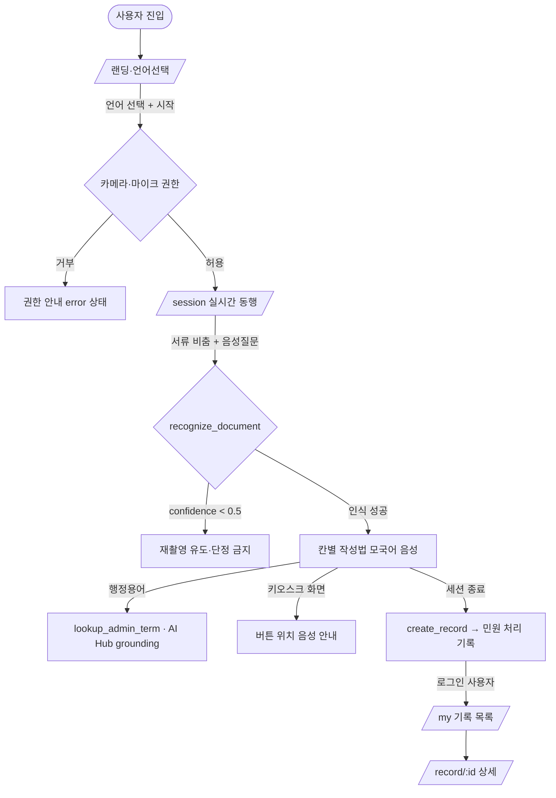

# CivicLens PRD — 외국인·디지털약자 민원동행 AI

> **Version**: 1.0
> **Created**: 2026-06-27
> **Status**: Draft
> **해커톤**: AI Hub 데이터 활용 + OpenAI Realtime 기반 실시간 멀티모달 에이전트
> **플랫폼**: **모바일 앱 (iOS / Android, Expo + React Native)** — `wigtn-timelens/mobile` Expo Router 앱 구조 재활용
> **기반 자산**: `wigtn-timelens/mobile` (Expo Router + expo-camera + expo-audio + WebSocket 실시간 세션) + Function Calling + i18n + Diary 구조
> **협업 구조**: 모노레포 3-스트림 병렬 개발(개발자 3인 동시) — `mobile/` · `server/` · `shared/`+`scripts/`. 상세는 `docs/todo_plan/PARALLEL_WORK_PLAN.md`
> **핵심 차별점**: "AI가 지어내지 않는다 — 국가 공인(AI Hub) 데이터로 grounding + 인식 정확도 정량 증명"

---

## 0. 한 줄 정의

> **카메라로 공문서를 비추고 모국어로 말하면, AI가 서류를 인식해 칸별 작성법과 안내를 모국어 음성으로 알려주고, AI Hub 공공데이터로 검증된 번역·용어를 제공하며, 끝나면 '오늘 처리한 민원' 기록을 자동 생성하는 실시간 민원동행 AI.**

---

## 1. Overview

### 1.1 Problem Statement

국내 체류 외국인(약 250만 명)과 디지털 취약계층은 **행정 민원의 첫 관문에서 막힌다.**

- **서식 장벽**: 전입신고서·외국인등록·건강보험 신청서 등은 한국어 전용이고, 칸별 의미가 불명확하다. "세대주", "전입사유" 같은 행정용어는 일반 번역기로도 오역되기 쉽다.
- **무인화 역설**: 무인민원발급기·키오스크가 늘면서 한국어를 못 읽으면 한 글자도 진행할 수 없다.
- **번역 신뢰성 공백**: 기존 LLM/번역 앱은 행정용어를 **그럴듯하게 지어낸다(환각).** 법적 효력이 걸린 서류에서 오역은 곧 반려·불이익이다.
- **현장성 부재**: 책상에 앉아 검색하는 게 아니라, **민원 창구/키오스크 앞에서 실시간으로** 도움이 필요하다. 텍스트 검색은 이 맥락에 맞지 않는다.
- **기록 공백**: 한 번 처리하고 나면 무엇을 어떻게 했는지 남지 않아, 다음 방문 때 같은 어려움을 반복한다.

### 1.2 Goals

- **G1.** 카메라로 비춘 한국 공문서/안내문을 실시간으로 **인식·분류**하고, 칸별 작성법을 사용자 모국어 **음성**으로 안내한다.
- **G2.** 번역·행정용어 설명을 **AI Hub 공공데이터로 grounding**하여 환각을 제거하고 "국가 공인 데이터 기반"임을 보장한다.
- **G3.** AI Hub 정답 라벨(문서종류/바운딩박스/OCR)을 평가셋으로 사용해 **"서식 인식 정확도 OO%"** 를 정량 증명한다(심사 어필 핵심).
- **G4.** 민원 처리 종료 시 **'민원 처리 기록(Record)'** 을 자동 생성해 재방문 시 참고하게 한다.
- **G5.** 5개 언어를 지원하되, 데모는 벤치마크상 **가장 정확도가 높은 1개 언어**로 집중 시연한다.

### 1.3 Non-Goals (Out of Scope)

- 실제 민원 **제출/전자정부 연동**(정부24, Hi Korea API 직접 제출)은 범위 외. CivicLens는 *안내·동행*이지 *대행 제출*이 아니다.
- 법률 자문/유권 해석 제공 — "공인 번역·서식 안내"까지만. 법적 책임지는 조언은 비목표.
- 오프라인 동작 / 온디바이스 추론 — MVP는 온라인 전제.
- Gemini Live, ADK 등 Google 스택 — **OpenAI 스택으로 전면 전환**(아래 §6 참조).
- 보행 안전(시각장애인 동행), 문화재 도슨트 주제 — 본 PRD 범위 외(별도 주제).

### 1.4 Scope

| 포함 | 제외 |
|------|------|
| 실시간 카메라 문서 인식 + 음성 칸별 안내 | 정부24/Hi Korea 실제 제출 연동 |
| 5개 언어(한·영·중·베트남·태국) 모국어 음성 I/O | 법률 자문/유권 해석 |
| AI Hub RAG grounding(행정용어/다국어/법률번역) | 온디바이스/오프라인 추론 |
| AI Hub 라벨 기반 인식 정확도 벤치마크 | 6개 이상 언어 동시 시연 |
| 민원 처리 기록(Record) 자동 생성·조회 | 결제/유료화 |
| 무인민원발급기 화면 버튼 위치 음성 안내 | 키오스크 제조사 SDK 직접 제어 |

---

## 2. User Stories

### 2.1 Primary User

- **As a** 한국어가 서툰 체류 외국인, **I want to** 민원 창구에서 받은 서류를 카메라로 비추고 모국어로 질문 **so that** 어느 칸에 무엇을 써야 하는지 음성으로 안내받아 혼자서도 작성할 수 있다.
- **As a** 디지털 취약 고령자, **I want to** 무인민원발급기 화면을 비추면 어떤 버튼을 눌러야 하는지 음성으로 안내받기 **so that** 직원 도움 없이 발급을 끝낼 수 있다.

### 2.2 Acceptance Criteria (Gherkin)

```gherkin
Scenario: 서류 인식 후 칸별 작성 안내
  Given 사용자가 언어를 "베트남어"로 선택하고 세션을 시작했고
    And 카메라로 전입신고서를 비추고 있다
  When 사용자가 베트남어로 "이거 어떻게 써요?"라고 말하면
  Then AI는 recognize_document 도구로 서류를 "전입신고서"로 분류하고
    And 칸별 작성법을 베트남어 음성으로 안내하며
    And 행정용어("세대주" 등)는 lookup_admin_term(AI Hub RAG)로 검증된 설명을 사용한다

Scenario: 환각 방지 — 불확실 시 추측 금지
  Given 카메라 프레임이 흐릿하거나 서류가 학습 분포 밖이다
  When recognize_document의 confidence < 0.5 이면
  Then AI는 서식명을 단정하지 않고 "보이는 것"만 설명하고 재촬영을 요청한다

Scenario: 무인민원발급기 버튼 안내
  Given 사용자가 무인민원발급기 화면을 비추고 있다
  When 사용자가 모국어로 "다음 뭐 눌러요?"라고 물으면
  Then AI는 화면의 버튼/메뉴 위치를 모국어 음성으로 안내한다

Scenario: 민원 처리 기록 자동 생성
  Given 사용자가 한 건의 민원 안내 세션을 종료한다
  When create_record 도구가 호출되면
  Then 처리한 서류명·날짜·핵심 안내 요약이 담긴 Record가 저장되고
    And /record/[id]에서 모국어로 다시 열람할 수 있다
```

### 2.3 User Roles

| Role Key | 한국어 명칭 | 권한 범위 | 비고 |
|----------|------------|----------|------|
| `guest` | 비로그인 사용자 | 익명 세션으로 실시간 동행 사용 가능, 기록은 디바이스 로컬에만 | Hobby 기본값 |
| `author` | 로그인 사용자 | 본인 Record read/write, 클라우드 동기화 | 익명 인증(anon) 업그레이드 |
| `admin` | 데모 운영자 | 인식 정확도 벤치마크 대시보드 열람 | 시연/심사용 내부 페이지 |

**규칙**: Role Key는 영문 소문자. 이후 모든 페이지/API 명세에서 이 키를 그대로 인용한다.

---

## 3. Functional Requirements

| ID | Requirement | Priority | Dependencies |
|----|------------|----------|--------------|
| FR-001 | OpenAI Realtime 세션 생성 + ephemeral client secret 발급(서버에서 발급, 클라이언트는 단명 토큰만 사용) | P0 (Must) | - |
| FR-002 | 카메라 프레임 + 모국어 음성을 Realtime 세션에 스트리밍하고 모국어 음성 응답 수신 | P0 (Must) | FR-001 |
| FR-003 | `recognize_document` Function Calling — 비춘 서류/안내문을 문서종류로 분류 + 칸 구조 추출 | P0 (Must) | FR-002 |
| FR-004 | `explain_field` — 특정 칸/항목의 작성법을 모국어로 단계 안내 | P0 (Must) | FR-003 |
| FR-005 | `lookup_admin_term` — AI Hub 행정용어/다국어 RAG에서 검증된 용어·번역 검색(grounding) | P0 (Must) | FR-003 |
| FR-006 | `translate_notice` — 안내문/공문 텍스트를 AI Hub 법률 다국어 번역 코퍼스로 grounding한 번역 | P0 (Must) | FR-005 |
| FR-007 | 5개 언어(한·영·중·베트남·태국) i18n + 언어별 시스템 프롬프트/음성 | P0 (Must) | FR-002 |
| FR-008 | `create_record` — 세션 종료 시 민원 처리 기록 자동 생성·저장 | P1 (Should) | FR-003 |
| FR-009 | Record 목록/상세 조회(`/my`, `/record/[id]`) | P1 (Should) | FR-008 |
| FR-010 | 무인민원발급기 화면 인식 → 버튼/메뉴 위치 음성 안내(recognize_document의 `kiosk` 모드) | P1 (Should) | FR-003 |
| FR-011 | `discover_office` — 위치 기반 인근 주민센터/무인민원발급기 안내 | P2 (Could) | FR-002 |
| FR-012 | **인식 정확도 벤치마크 파이프라인** — AI Hub OCR/문서분류 라벨로 평가셋 구성, top-1 정확도 산출, 대시보드 표시 | P0 (Must) | FR-003 |
| FR-013 | AI Hub 데이터 적재·임베딩 스크립트(행정용어/다국어/법률번역 → 벡터스토어) | P0 (Must) | - |
| FR-014 | confidence 임계값 기반 환각 가드(불확실 시 단정 금지·재촬영 유도) | P0 (Must) | FR-003 |
| FR-015 | **서버측 결정적 PII 마스킹** — Record 저장 직전 정규식+NER로 실명·주소·외국인등록번호·전화 차단, `visits`는 비식별 구조화 필드로 제한 | P0 (Must) | FR-008 |
| FR-016 | **비용/남용 가드** — ephemeral 토큰 세션시간·출력토큰·턴 상한 + 발급 레이트리밋 + 일일 비용 캡(초과 시 신규 발급 차단) | P0 (Must) | FR-001 |

---

## 4. Non-Functional Requirements

### 4.0 Scale Grade — **Hobby (해커톤)**

| 항목 | 값 |
|------|-----|
| 일일 사용자(DAU) | < 1,000 (데모/심사) |
| 동시접속 | < 100 |
| 데이터량 | < 1GB(임베딩 인덱스 + Record) |
| 추천 인프라 | 단일 서버, Vercel/Cloud Run 무료~저비용, 관리형 벡터스토어 무료 티어 |

### 4.1 Performance SLA

| 지표 | 목표값 | 비고 |
|------|--------|------|
| 음성 첫 응답 지연(first audio token) | < 800ms (p95) | Realtime 음성 자연스러움 핵심 |
| 문서 인식 응답(recognize_document 완료) | < 2.5s (p95) | 카메라 프레임 1장 기준 |
| RAG 검색(lookup_admin_term) | < 400ms (p95) | 벡터 top-k 검색 |
| Throughput | < 50 RPS | Hobby 충분 |

> Hobby/Startup 가이드(p95 < 500ms, RPS < 100)에 부합. 음성 지연만 Realtime 특성상 별도 타이트 관리.

### 4.2 Availability SLA

| 등급 | 추천 Uptime | 허용 다운타임(월) |
|------|------------|-----------------|
| **Hobby** | 95% | 36시간 |

> 데모 기간(심사일) 동안만 99% 목표로 운영. OpenAI Realtime API 장애 시 §6.5 폴백(텍스트 모드 + gpt-4o 비전) 자동 전환.

### 4.3 Data Requirements

| 항목 | 값 |
|------|-----|
| 임베딩 인덱스 | < 500MB (행정용어집 + 다국어 매핑 + 법률번역 일부 샘플) |
| Record 데이터 | 사용자당 < 1MB |
| 월간 증가율 | 데모 기간 한정, 무시 가능 |
| 데이터 보존 | Record 90일(익명), 로그인 시 영구 |
| AI Hub 라이선스 | 비영리·연구 목적 활용 범위 내 사용, 출처 명시(데모/제출물 한정) |

### 4.4 Recovery

| 항목 | 기본값(Hobby) |
|------|----------------|
| RTO | 24시간 |
| RPO | 24시간 (Record는 일 1회 백업, 임베딩 인덱스는 스크립트 재생성 가능) |

### 4.5 Security

- **Authentication**: Core(실시간 동행)는 Optional(익명 세션). Record 클라우드 저장은 익명 인증 토큰 필요.
- **API Key 보호**: OpenAI 비밀키는 **서버에만** 보관. 클라이언트는 단명(ephemeral) client secret만 수신(FR-001). 비밀키 클라이언트 노출 금지. `NEXT_PUBLIC_*`에 키 포함 금지.

- **비용/남용 가드 (FR-016, C-1 대응)**:
  | 가드 | 값(Hobby/데모) |
  |------|----------------|
  | ephemeral 토큰 발급 레이트리밋 | IP당 6/min, 60/day · 디바이스 세션당 동시 1개 |
  | 토큰 max session duration | 5분 (만료 시 재발급 필요) |
  | 토큰 max output tokens / max turns | 4,000 토큰 / 40 turn |
  | `/recognize` 이미지 상한·빈도 | ≤ 4MB/요청, IP당 20/min |
  | **일일 비용 캡(budget guard)** | OpenAI 사용량 합산 임계 도달 시 신규 토큰 발급 즉시 차단(503 BUDGET_EXCEEDED) + 운영자 알림 |
  > ephemeral 토큰은 발급 후 클라이언트가 OpenAI Realtime과 직접 통신하므로, "발급 빈도 제한"만으로는 부족하다 → **토큰 자체의 시간·토큰·턴 상한**을 발급 시 설정해 토큰당 실사용량을 봉인한다.

- **PII 처리 (FR-015, C-2 대응)**:
  - 카메라 프레임/원음성은 **저장하지 않고** 추론에만 사용(in-memory, 세션 종료 시 폐기).
  - **모델 생성 텍스트를 신뢰하지 않는다.** `create_record`가 만든 요약은 저장 직전 **서버측 결정적 PII 파이프라인**(정규식: 외국인등록번호/주민번호/전화/이메일 패턴 + NER: 인명·상세주소)을 통과해야 하며, 탐지 시 마스킹 또는 저장 거부(`422 PII_DETECTED`).
  - `Record.visits`는 자유서술 `summary`가 아니라 **비식별 구조화 필드**(`docTypeId`, `guidedFieldKeys[]`, `noteSafe`)로 제한(§5.2). 식별정보가 구조적으로 들어갈 자리를 없앤다.
  - "완료" 기준에 **저장 데이터 PII 스캔 테스트**를 포함(AGENTS.md).

- **Data encryption**: In transit(TLS/WebRTC SRTP), at rest(벡터스토어·Record DB 암호화).
- **CORS / Origin**: 게스트 공개 API는 허용 Origin 화이트리스트(배포 도메인 + 로컬 dev)로 제한. 와일드카드 `*` 금지.

---

## 5. Technical Design

### 5.1 API Specification

> 백엔드는 REST(엔드포인트) + OpenAI Realtime(WebRTC/WebSocket 실시간) 하이브리드. 실시간 추론·음성·비전은 Realtime 세션 내 **Function Calling**으로, 데이터 적재·기록·벤치마크는 REST로 처리.
>
> **응답 엔벨로프 규약**: 모든 `/api/v1/*` 응답은 `{ success: true, data: <아래 Response 200 본문> }` 또는 `{ success: false, error: { code, message, retryable } }` 형식(TimeLens `ApiResponse<T>` 계승). 아래 각 엔드포인트의 "Response 200"은 **`data` 페이로드**를 가리킨다.
>
> **Function Calling tool-call 인증 흐름**: Realtime 모델이 도구를 호출하면 tool-call 이벤트가 **클라이언트(WebRTC 데이터 채널)로 전달**되고, 클라이언트가 해당 핸들러 엔드포인트(`/rag/query` 등)를 **자신의 세션 토큰**으로 호출한 뒤 결과를 Realtime 세션에 다시 주입한다. 따라서 `/rag/query`·`/records`의 Auth "Required"는 **서버 발급 세션 토큰(짧은 수명, `realtime/session` 발급 시 함께 내려줌)** 검증을 의미하며, OpenAI 비밀키와 무관하다.

#### `POST /api/v1/realtime/session`
- **Description**: OpenAI Realtime 세션을 서버에서 생성하고 단명 client secret을 반환. 클라이언트는 이 토큰으로 WebRTC 연결.
- **Auth**: Optional (guest 허용)
- **Request**: `{ language: "ko"|"en"|"zh"|"vi"|"th" (required), mode?: "document"|"kiosk" }`
- **Response 200**: `{ sessionId: string, clientSecret: string (ek_...), expiresAt: number, model: "gpt-realtime", voice: string, sessionToken: string, limits: { maxDurationSec: 300, maxOutputTokens: 4000, maxTurns: 40 } }` — `sessionToken`은 tool-call 핸들러(`/rag/query` 등) 호출용 단명 토큰
- **Errors**: `400 INVALID_LANGUAGE`, `429 RATE_LIMITED (IP 6/min·60/day 초과)`, `503 BUDGET_EXCEEDED (일일 비용 캡 도달)`, `500 SESSION_CREATE_FAILED (retryable)`

#### `POST /api/v1/rag/query`
- **Description**: 행정용어/다국어 매핑 RAG 검색. Realtime의 `lookup_admin_term`/`translate_notice` 도구 핸들러가 호출.
- **Auth**: Required (세션 토큰 — §5.1 tool-call 인증 흐름 참조)
- **Request**: `{ query: string (required), targetLang: string (required), topK?: number=5, source?: "admin_term"|"legal_translation"|"office" }`
- **Response 200**: `{ matches: [{ term: string, definition: string, translation: string, sourceLabel: string, score: number }] }`
- **Errors**: `400 INVALID_INPUT`, `404 NO_MATCH`, `500 RAG_FAILED (retryable)`

#### `POST /api/v1/recognize` (서버 비전 폴백)
- **Description**: Realtime 이미지 입력이 제약될 때, 카메라 프레임을 `gpt-4o` 비전으로 문서 분류. 벤치마크에서도 동일 경로 사용.
- **Auth**: Optional
- **Request**: `{ imageBase64: string (required), language: string (required) }`
- **Response 200**: `{ docType: string, docTypeId: string, confidence: number, fields: [{ label, hint }], isKiosk: boolean }`
- **Errors**: `400 INVALID_IMAGE`, `422 LOW_CONFIDENCE`, `500 VISION_FAILED (retryable)`

#### `POST /api/v1/records`
- **Description**: 민원 처리 기록 생성(`create_record` 핸들러).
- **Auth**: Optional(guest=로컬, author=클라우드)
- **Request**: `{ sessionId: string, language: string, visits: [{ docTypeId: string, guidedFieldKeys?: string[], noteSafe?: string }] (min 1) }` — 자유서술 금지, 서버가 `noteSafe`에 PII 파이프라인(FR-015) 적용 후 저장
- **Response 200**: `{ recordId: string, createdAt: number, piiScrubbed: true }`
- **Errors**: `400 INVALID_INPUT`, `401 UNAUTHORIZED(클라우드 저장 시)`, `422 PII_DETECTED`, `500 RECORD_FAILED`

#### `GET /api/v1/records/:id`
- **Description**: Record 상세 조회.
- **Auth**: Required(author) — 본인 소유만
- **Response 200**: `{ recordId, language, visits[], createdAt }`
- **Errors**: `403 FORBIDDEN`, `404 NOT_FOUND`

#### `GET /api/v1/offices/nearby`
- **Description**: 인근 주민센터/무인민원발급기 검색(`discover_office`).
- **Auth**: Optional
- **Request(query)**: `lat (required), lng (required), radiusKm?=2`
- **Response 200**: `{ offices: [{ name, type, address, distanceM, hours }] }`
- **Errors**: `400 INVALID_COORDS`, `500 PLACES_FAILED`

#### `GET /api/v1/benchmark` (데모/심사용)
- **Description**: AI Hub 라벨 평가셋 기반 최신 인식 정확도 집계.
- **Auth**: Required(admin)
- **Response 200**: `{ overallTop1: number, perDocType: [{ docTypeId, accuracy, n }], perLang: [{ lang, translationBLEU?: number }], evaluatedAt: number }`
- **Errors**: `403 FORBIDDEN`

#### `GET /api/v1/health`
- **Response 200**: `{ status: "ok", openai: boolean, vectorStore: boolean }`

#### Realtime Function Calling 도구(모델이 세션 내 호출)

| Tool | 역할 | 핸들러 매핑 |
|------|------|-------------|
| `recognize_document` | 비춘 서류/키오스크 화면 분류 + 칸 구조 추출 | (Realtime 비전) 또는 `POST /api/v1/recognize` |
| `explain_field` | 특정 칸 작성법 모국어 단계 안내 | 모델 내 추론 + `lookup_admin_term` |
| `lookup_admin_term` | AI Hub 행정용어/다국어 검증 검색 | `POST /api/v1/rag/query` (source=admin_term) |
| `translate_notice` | 안내문 공인 번역 grounding | `POST /api/v1/rag/query` (source=legal_translation) |
| `create_record` | 민원 처리 기록 생성 | `POST /api/v1/records` |
| `discover_office` | 인근 민원 창구 안내 | `GET /api/v1/offices/nearby` |

### 5.2 Database Schema

```
Record (Firestore/Postgres)
  recordId: string (PK)
  ownerId: string | null      # author=uid, guest=null(로컬)
  language: string
  visits: Visit[]             # 비식별 구조화 필드만 (FR-015)
                              #   { docTypeId: string,            # 분류 ID (자유서술 아님)
                              #     guidedFieldKeys: string[],     # 안내한 칸 키 (PII 아님)
                              #     noteSafe: string }             # 서버 PII 마스킹 통과 텍스트
  piiScrubbed: boolean        # 저장 전 PII 파이프라인 통과 플래그
  createdAt: timestamp
  expiresAt: timestamp        # guest 90일 TTL

AdminTermEmbedding (Vector Store)
  id: string
  source: "admin_term"|"legal_translation"|"poi"
  term_ko: string
  translations: { en, zh, vi, th }
  definition: string
  sourceLabel: string         # AI Hub 데이터셋 출처 라벨
  embedding: vector(1536)     # text-embedding-3-small

BenchmarkRun (append-only)
  runId, evaluatedAt
  overallTop1, perDocType[], perLang[]
  datasetVersion              # AI Hub 라벨 스냅샷
```

### 5.3 Architecture (한 장)

```
┌──────────── 모바일 앱 (Expo / React Native, WebSocket) ───────────┐
│  카메라 프레임 ──┐                                              │
│  음성(모국어) ───┼─→ OpenAI Realtime 세션 (gpt-realtime)        │
│                  │        │  speech-to-speech + vision           │
│  모국어 음성 ◀───┘        │  + Function Calling                  │
└───────────────────────────┼──────────────────────────────────┘
                            │ (단명 client secret)
        ┌───────────────────┼───────────────────────────────┐
        ▼                   ▼                ▼               ▼
 recognize_document   lookup_admin_term  translate_notice  create_record
        │                   │                │               │
   (Realtime 비전 /     POST /rag/query  POST /rag/query   POST /records
    POST /recognize)        │                │
        │                   └──── 벡터스토어(AI Hub 임베딩) ───┘
        │                          ▲
   환각 가드(conf<0.5)        적재·임베딩 스크립트(FR-013)
                                   ▲
                          AI Hub: 공공행정문서 OCR / 행정용어 /
                          국내 법률 다국어 번역 / 한국어-다국어 말뭉치

[벤치마크] AI Hub 라벨(문서분류/OCR) ──→ /recognize 평가 ──→ /benchmark 대시보드
```

### 5.4 Pages

> Expo Router 화면. `Route`는 모바일 스크린 경로, `Platform`은 대상 OS.

| Screen (expo-router) | Audience | Auth | Linked FRs | Has FE Components | Primary State | Platform |
|-------|----------|------|-----------|-------------------|---------------|-----------|
| `app/index` (랜딩·언어선택) | guest, author | Optional | FR-007 | Yes | success | iOS / Android |
| `app/session` (실시간 동행) | guest, author | Optional | FR-001~FR-011, FR-014 | Yes | loading / success / error | iOS / Android |
| `app/my` (기록 목록) | author | Required | FR-009 | Yes | empty / success / no-permission | iOS / Android |
| `app/record/[id]` (기록 상세) | author | Required | FR-009 | Yes | loading / success / error | iOS / Android |
| `app/benchmark` (정확도 대시보드) | admin | Required | FR-012 | Yes | loading / success / no-permission | iOS / Android (태블릿 권장) |
| `server /api/v1/*` | - | Optional/Required | FR-001~FR-013 | No (API) | - | - |

### 5.4.1 Page State Matrix

| Route | loading | empty | error | success | no-permission | 비고 |
|-------|---------|-------|-------|---------|---------------|------|
| `/` | - | - | - | ✓ | - | 언어 선택 + 시작 |
| `/session` | ✓ | - | ✓ | ✓ | ✓ | 카메라/마이크 권한 거부 시 error, Realtime 연결 중 loading |
| `/my` | ✓ | ✓ | ✓ | ✓ | ✓ | Record 0건 시 empty, 비로그인 접근 시 no-permission |
| `/record/[id]` | ✓ | - | ✓ | ✓ | ✓ | 타인 Record 접근 시 no-permission(403) |
| `/benchmark` | ✓ | ✓ | ✓ | ✓ | ✓ | admin 아니면 no-permission |

**규칙**: 체크된 상태마다 `/screen-spec`에서 1줄 이상 마이크로카피/UI 처리 명시.

### 5.5 User Flow



---

## 6. Technical Design — 스택 전환 (Gemini → OpenAI)

> **핵심 결정**: 실시간 음성/비전/Function Calling 파이프라인을 **OpenAI Realtime API**로 전면 전환. TimeLens의 *구조와 UX 패턴은 재활용*, *추론 엔진과 SDK는 교체*.

### 6.1 모델 / SDK

| 용도 | OpenAI 구성 |
|------|-------------|
| 실시간 음성+비전+Function Calling | `gpt-realtime` (Realtime API) — **모바일은 WebSocket 전송**(`react-native-url-polyfill` 위 WS, TimeLens `live-api.ts` 패턴 계승) |
| 카메라 / 오디오 | `expo-camera`(프레임 캡처) + `expo-audio`(마이크 캡처/재생, base64 PCM) |
| 비전 폴백·벤치마크 분류 | `gpt-4o` (Chat Completions, image input) — 서버측 |
| RAG 임베딩 | `text-embedding-3-small` (1536d, 비용 우선) — 서버측 |
| 단명 인증 | 서버 `POST /api/v1/realtime/session` → OpenAI `client_secret`(ek_…) + 사용 상한; 모바일은 단명 토큰으로만 WS 연결 |
| 음성 입력 전사(옵션) | `input_audio_transcription`(gpt-4o-transcribe) |
| SDK | `openai`(Node) 서버측 / 모바일은 WebSocket + 단명 토큰(비밀키 미탑재) |

> **모바일 전송 주의**: OpenAI Realtime은 WebRTC가 1순위지만, RN에서 WebRTC는 `react-native-webrtc` 네이티브 모듈 + 개발 빌드가 필요하다. TimeLens 모바일이 이미 **WebSocket 기반 실시간 세션**(`mobile/lib/.../live-api.ts`)으로 동작하므로, **MVP는 WebSocket 전송으로 통일**(Expo Go 호환 우선). 지연이 문제되면 Phase 3에서 WebRTC(개발 빌드)로 업그레이드.

### 6.2 TimeLens → CivicLens 파일 매핑

| 기존 (TimeLens, Gemini) | CivicLens (OpenAI) | 처리 |
|---|---|---|
| `src/shared/gemini/tools.ts` (`recognize_artifact` 등) | `src/shared/openai/tools.ts` (`recognize_document`, `explain_field`, `lookup_admin_term`, `translate_notice`, `create_record`, `discover_office`) | **교체**(도구 선언 + 시스템 프롬프트) |
| `src/back/lib/gemini/{client,token}.ts` | `src/back/lib/openai/{client,realtime-token}.ts` | **교체**(OpenAI 클라이언트·ephemeral 발급) |
| `src/back/lib/gemini/search-grounding.ts` | `src/back/lib/rag/retriever.ts` + `embed.ts` | **재구현**(Search Grounding → AI Hub RAG) |
| `src/app/api/session/route.ts` | `src/app/api/v1/realtime/session/route.ts` | **교체**(OpenAI 토큰) |
| `src/back/agents/curator.ts` (텍스트 폴백) | `src/back/agents/clerk.ts` (민원 도우미 폴백) | **재작성**(프롬프트·페르소나) |
| `src/back/agents/restoration.ts` / `generate_restoration` | — | **제거**(복원 불필요) |
| `discover_nearby` / `museums/*` | `discover_office` / `offices/nearby` | **재용도**(박물관→민원창구) |
| `src/app/api/diary/*`, `diary.ts` | `src/app/api/v1/records/*`, `record.ts` | **재용도**(다이어리→민원 기록) |
| `src/shared/i18n/*` | `src/shared/i18n/*` (+ vi, th 추가) | **확장**(언어 추가) |
| `mobile/lib/audio/*`, `mobile/lib/camera/capture.ts`, `mobile/hooks/use-live-session.ts`, `mobile/lib/gemini/live-api.ts` | `mobile/lib/{audio,camera}`, `use-live-session.ts`, `mobile/lib/openai/realtime-ws.ts` | **유지/재배선**(전송 골격 유지, 메시지 스키마만 OpenAI 형식으로) |
| `mobile/app/{index,session}.tsx`, `mobile/components/*` | `mobile/app/{index,session,my,record/[id],benchmark}.tsx` | **재활용/추가**(카피·라벨 교체 + 화면 추가) |
| `src/app/diary/[id]/page.tsx`, `session/page.tsx`, `page.tsx` | `record/[id]`, `session`, `/` | **재활용**(카피·라벨 교체) |

> 결론: **카메라·오디오 I/O, 세션 라이프사이클, Function Calling 오케스트레이션 골격은 유지**. 바뀌는 건 (1) SDK/토큰 발급, (2) 도구 선언·시스템 프롬프트, (3) grounding 소스(Search→AI Hub RAG), (4) 도메인 카피/i18n.

### 6.3 AI Hub 적극 활용 — 3대 메커니즘 (심사 어필)

1. **RAG 지식베이스(grounding)** — AI Hub *공공행정문서 OCR* 용어, *한국어-다국어 말뭉치*, *국내 법률 다국어 번역(5개국어)*, *관광 POI* 설명을 임베딩 → 벡터스토어. Realtime의 `lookup_admin_term`/`translate_notice`가 이를 검색해 **"환각 대신 국가 공인 데이터"** 로 답한다.
2. **인식 정확도 벤치마크(정량 증명)** — AI Hub *공공행정문서 OCR*의 문서종류/바운딩박스/OCR 정답을 평가셋으로 사용. `/recognize`의 top-1 분류 정확도를 산출해 **"서식 인식 정확도 OO%"** 를 `/benchmark` 대시보드에 표기. 데모에서 숫자가 곧 점수.
3. **(여유 시) few-shot 프롬프트 주입** — 보행/공공서식 분류 샘플을 few-shot 예시로 시스템 프롬프트에 삽입. (P2, MVP 필수 아님)

### 6.4 데이터 적재 파이프라인 (FR-013)

```
scripts/ingest-aihub.ts
  1) AI Hub 원천 로드(공공행정문서 OCR / 행정용어 / 법률 다국어 / 다국어 말뭉치)
  2) 정규화 → { term_ko, translations{en,zh,vi,th}, definition, sourceLabel }
  3) text-embedding-3-small 임베딩
  4) 벡터스토어 upsert (source 태깅)
scripts/build-eval-set.ts
  - 공공행정문서 OCR 라벨에서 문서종류 정답 평가셋 분리(train 제외, hold-out)
scripts/run-benchmark.ts
  - 인식: /recognize 호출 → 문서종류 top-1 정확도(문서종류별/전체) → BenchmarkRun 저장
  - 번역(M-1): AI Hub 법률 다국어 번역의 hold-out 쌍을 정답 참조로,
    translate_notice 출력 vs 공인 번역 chrF/BLEU 산출(언어별). 정답쌍 없으면 perLang.translationBLEU=null.
```

> **벤치마크 데이터 누수 방지**: `build-eval-set.ts`가 분리한 hold-out은 RAG 인덱스(FR-013)·few-shot 예시에서 **제외**한다. `datasetVersion`에 스냅샷 해시를 기록해 train/eval 분리를 추적한다.

### 6.5 폴백 전략

- Realtime 연결 실패/이미지 입력 제약 → **텍스트 모드 + `POST /api/v1/recognize`(gpt-4o 비전)** 자동 전환(`clerk.ts` 폴백 에이전트).
- RAG 무매칭 → 모델은 **"공인 데이터에 없음"** 을 명시하고 일반 번역으로 보조하되 *법적 효력 주의* 안내.

---

## 7. Implementation Phases

### Phase 1: MVP (실시간 동행 코어)
- [ ] OpenAI 클라이언트 + ephemeral 토큰 발급(`/api/v1/realtime/session`) — FR-001
- [ ] WebRTC 카메라+음성 스트리밍, 세션 UI 재활용 — FR-002
- [ ] `recognize_document` + `explain_field` 도구 선언·시스템 프롬프트(`openai/tools.ts`) — FR-003, FR-004
- [ ] 환각 가드(confidence<0.5) — FR-014
- [ ] 한국어+1개 언어(데모 후보) i18n — FR-007(부분)
**Deliverable**: 카메라로 서류 비추고 모국어 음성으로 칸별 안내받는 동작 데모

### Phase 2: AI Hub Grounding + 벤치마크 (차별점)
- [ ] AI Hub 적재·임베딩 스크립트 + 벡터스토어 — FR-013
- [ ] `lookup_admin_term`/`translate_notice` RAG 연결 — FR-005, FR-006
- [ ] 평가셋 구성 + 벤치마크 파이프라인 + `/benchmark` 대시보드 — FR-012
- [ ] 5개 언어 전체 i18n, 데모 언어 벤치마크로 확정 — FR-007
**Deliverable**: "인식 정확도 OO%" 숫자 + 공인 데이터 grounding 데모

### Phase 3: 기록 & 보조 기능
- [ ] `create_record` + Record 저장/조회(`/my`, `/record/[id]`) — FR-008, FR-009
- [ ] 무인민원발급기 kiosk 모드 — FR-010
- [ ] `discover_office` 인근 창구 안내 — FR-011 (P2)
**Deliverable**: 종단 시나리오(동행→기록→재열람) + 제출용 데모 영상

---

## 8. Success Metrics

| Metric | Target | Measurement |
|--------|--------|-------------|
| 서식 인식 top-1 정확도 | ≥ 90% | AI Hub 라벨 평가셋(`/benchmark`) |
| 음성 첫 응답 지연(p95) | < 800ms | Realtime 클라이언트 계측 |
| RAG grounding 적용률 | ≥ 95% (용어 질의 중) | `lookup_admin_term` 호출/응답 로그 |
| 환각 가드 발동 정확성 | 저신뢰 프레임 단정 0건 | 데모 시나리오 수동 검증 |
| 종단 시나리오 완주율 | 데모 3종 100% | 동행→기록 E2E 리허설 |

---

## 9. 부록 — 데모 스크립트(개요)

1. 베트남어(혹은 벤치마크 1위 언어) 선택 → `/session` 진입
2. 전입신고서 비춤 + "이거 어떻게 써요?" → `recognize_document` "전입신고서" + 칸별 안내
3. "세대주가 뭐예요?" → `lookup_admin_term`로 AI Hub 검증 정의(환각 대비 강조)
4. 무인민원발급기 화면 비춤 → 버튼 위치 음성 안내
5. 종료 → `create_record` → `/record/[id]` 재열람
6. `/benchmark`로 "서식 인식 정확도 OO%" 숫자 마무리
